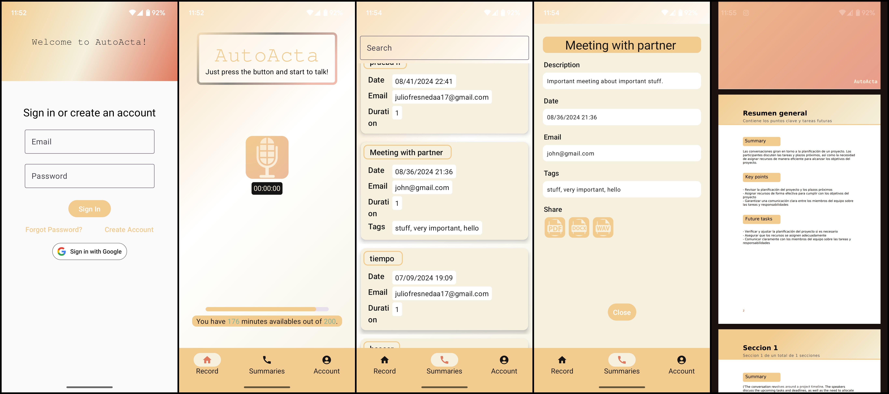
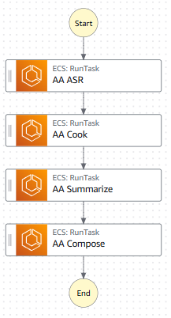

# AutoActa

AutoActa is your personal secretary.

It summarizes your conversation, gives you the key points and future tasks talked about, and the complete transcription.

The report is sent to your email. Keep in mind that AutoActa uses generative AI, so if the conversation is too short, it can hallucinate.

# What do we use as backend
AutoActa uses AWS Amplify to manage user authentication and management. 

For AI stuff, it uses containers that are run in AWS Step Functions:

## Step 1: Speech recognition
AutoActa uses ChatGPT API to get the text of the audio recorded.
Container can be found [here](https://hub.docker.com/repository/docker/juliofresneda/aa_asr_api).

## Step 2: "Cook"
Given the raw text, AutoActa needs to prepare it for the summarize and compose tasks.
Container can be found [here](https://hub.docker.com/repository/docker/juliofresneda/aa_cook_transcription/general).

## Step 3: Summarize
Also using ChatGPT, AutoActa summarizes the text and extracts key points and future tasks. For long conversations, it uses a Map-Reduce strategy.
Container can be found [here](https://hub.docker.com/repository/docker/juliofresneda/aa_summarize).

## Step 4: Compose
Given the transcription and summaries, it composes them in a PDF using a .docx template and python docx libraries.
Container can be found [here](https://hub.docker.com/repository/docker/juliofresneda/aa_compose).

# It is in Play Store?
It is not. Google asks for 20 beta testers before give us green light to launch it, and I don't have 20 friends.

I hope you find this interesting! See u.
